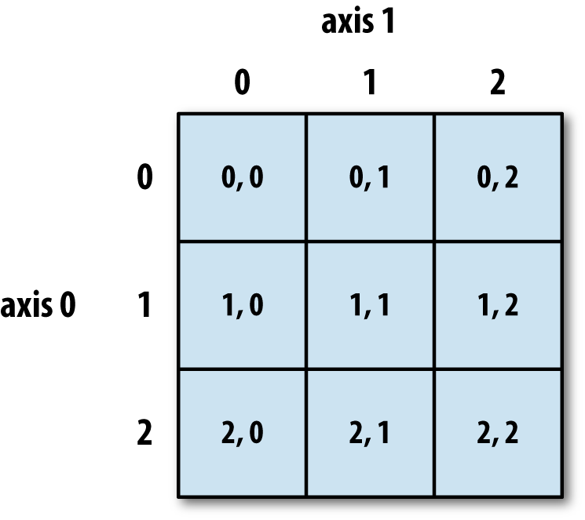
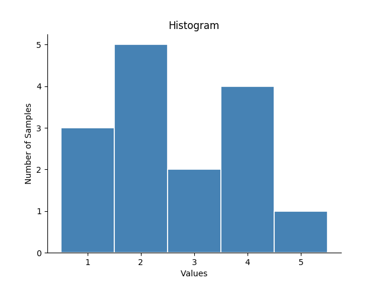
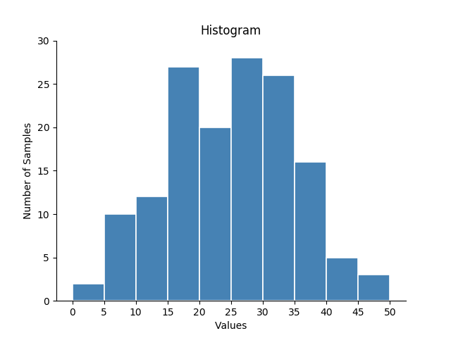

# Intro to NumPy

## What's NumPy ?

NumPy is a  powerful Python module, which stands for Numerical Python. Numpy is the fundamental package for scientific computing.

NumPy has many feature including large, multi-dimensional arrays and matrices, along with a large collection of high-level mathematical functions to operate on these arrays.

## Let's start coding !!

### Importing NumPy

To use NumPy we have to import it.

```python
import numpy as np 
```

Writing as np allows us to use np as a shorthand for NumPy, which saves us time.


### NumPy Arrays

The array holds and represents any regular data in a structured way.
Arrays are powerful because it give us special ways of performing mathematical operations.

```python
my_array = np.array([1, 2, 3, 4, 5, 6])
```

We can transform a regular list into a NumPy array

```python
my_list = [1, 2, 3, 4, 5, 6]
np_array = np.array(my_list)
```

If we wanted to select the first element in this array, we would call:
```python
print(np_array[0])
1
```

We can also select negative indices, which count from opposite end of the array and start at -1. 
```python
print(np_array[-1])
6
```

If we wanted to select multiple elements in the array, we can define a range, such as np_array[1:3], which will select all the elements from np_array[1] to np_array[3], including np_array[1] but excluding np_array[3].
```python
print(np_array[1:4])
[2, 3, 4]
```


#### 2-Dimensional Arrays

We can create an array of arrays and it's named a two-dimensional array.

```python
sample = np.array([1, 2, 3, 4, 5], [6, 7, 8, 9, 10], [11, 12, 13, 14,15])
```
A two-dimensional array is a list of lists where each list has the same number of elements. Here are some examples that are not two-dimensional arrays.
```python
np.array([[29, 49,  6], 
          [77,  1]])
```
This code will not run because the [] for the outer lists are missing:
```python
np.array([68, 16, 73],
         [61, 79, 30])
```

The syntax for selecting from a 2-d array is np.array[row,column].
A two-dimensional array has two axes: axis 0 represents the values that share the same indexical position (are in the same column), and axis 1 represents the values that share an array (are in the same row). This is illustrated below.



```python
sample2D = np.array([[00, 1, 2, 3, 4],
                     [10, 11, 12, 13, 14],
                     [20, 21, 22, 23, 24]])
print(saple2D[1,2])
12 
```
To selects the first column
```python
print(sample2D[:,0])
[00, 10, 20]
```

#### 3-Dimensional Arrays

Let's see how a 3-D Array look like:
```python
# A 3-D array, shape-(2, 2, 2)
np.array([[[0, 1],
           [2, 3]],

          [[4, 5],
           [6, 7]]])
```

Thus d3_array[0, 1, 0] specifies the element residing in sheet-0, at row-1 and column-0:
```python
# retrieving a single element from a 3D-array
>>> d3_array[0, 1, 0]
2
```

d3_array[:, 0, 0] specifies the elements in row-0 and column-0 of both sheets:
```python
# retrieving a 1D sub-array from a 3D-array
>>> d3_array[:, 0, 0]
array([0, 4])
```


### Creating an Array from a CSV 

Typically, you won't be entering data directly into an array. Instead, you'll be importing the data from somewhere else.

We're able to transform CSV (comma-separated values) files into arrays using the np.genfromtxt() function:

Create a test.csv in excel(when you save your file save it as .csv)

```python
csv_array = np.genfromtxt('test.csv', delimiter=',')

print(csv_array)
```

> In this case, our file sample.csv has values separated by commas, so we use delimiter=',', but sometimes you could find files with other delimiters.

### Operations with NumPy Arrays 

Generally, NumPy arrays are more efficient than lists.

Let's see it, by comparing how to add a number to each value in a python list versus a NumPy array: 

```python
# With a list
l = [1, 2, 3, 4, 5]
l_plus_6 = []
for i in range(len(l)):
    l_plus_6.append(l[i] + 6)
```

```python
# With an array
a = np.array(l)
a_plus_6 = a + 6
```

Squaring each value:
```python
# With an array
a ** 2
```

When adding or subtracting arrays in NumPy, each element will be added/subtracted to its matching element :
```python
a = np.array([1, 2, 3, 4, 5])
b = np.array([6, 7, 8, 9, 10])
c = a + b
print(c)
[ 7,  9, 11, 13, 15]
```

> To find more check [this docs](https://www.scipy-lectures.org/intro/numpy/operations.html)

### Logical Operations with Arrays

Another useful thing that arrays can do is perform element-wise logical operations. For instance, suppose we want to know how many elements in an array are greater than 5. We can easily write some code that checks to see whether this statement evaluates to True for each item in the array, without having to use a for loop :
```python
sample = np.array([1, 2, 3, 4, 5, 6, 7, 8, 9, 10])
print(sample > 5)
[False, False, False, False, False, True, True, True, True, True]
```
We can then use logical operators to evaluate and select items based on certain criteria. To select all elements from the previous array that are greater than 5, we'd write the following:
```python
print(sample[sample > 5])
[6, 7, 8, 9, 10]
```
We can also combine logical statements to further specify our criteria. To do so, we place each statement in parentheses and use boolean operators like & (and) and | (or).

## Introduction to Statistics with NumPy


### Introduction
We'll explore how we can use NumPy to analyze data.
The statistical concepts that we'll cover include:
-Mean
-Median
-Percentiles
-Interquartile Range
-Outliers
-Standard Deviation

### NumPy and Mean

The first statistical concept we'll explore is mean, also commonly referred to as an average. NumPy has a built-in function to calculate the average or mean of arrays: **np.mean**
```python
sample = np.array([1, 2, 3, 4, 5, 6, 7, 8, 9, 10])
print(np.mean(sample))
5.5
```

### Mean and Logical Operations

As we know, a logical operator will evaluate each item in an array to see if it matches the specified condition. If the item matches the given condition, the item will evaluate as **True** and equal 1. If it does not match, it will be **False** and equal 0.

When **np.mean** calculates a logical statement, the resulting mean value will be equivalent to the total number of True items divided by the total array length.

For example:
```python
sample = np.array([1, 2, 3, 4, 5, 6, 7, 8, 9, 10])
print(np.mean(sample > 5))
0.5
```
The logical statement **sample > 5** evaluates which numbers were greater than 5, and assigns them a value of 1. **np.mean** adds all of the 1s up and divides them by the **length of sample**. The resulting output tells us that 50% of numbers are more than 5.

### Calculating the Mean of 2D Arrays

If we have a two-dimensional array, **np.mean** can calculate the means of the larger array as well as the interior values.

Let's imagine a game of ring toss at a carnival. In this game, you have three different chances to get all three rings onto a stick. In our ring_toss array, each interior array (the arrays within the larger array) is one try, and each number is one ring toss. 1 represents a successful toss, 0 represents a fail.

First, we can use **np.mean** to find the mean across all the arrays:
```python
ring_toss = np.array([[1, 0, 0], 
                      [0, 0, 1], 
                      [1, 0, 1]])
print(np.mean(ring_toss))
0.44444444444444442
```
To find the means of each interior array, we specify axis 1 (the "rows"):
```python
print(np.mean(ring_toss, axis=1))
[ 0.33333333,  0.33333333,  0.66666667]
```
To find the means of each index position (i.e, mean of all 1st tosses, mean of all 2nd tosses, ...), we specify axis 0 (the "columns"):
```python
print(np.mean(ring_toss, axis=1))
[ 0.33333333,  0.33333333,  0.66666667]
```
To find the means of each index position (i.e, mean of all 1st tosses, mean of all 2nd tosses, ...), we specify axis 0 (the "columns"):
```python
print(np.mean(ring_toss, axis=0))
[ 0.66666667,  0.        ,  0.66666667]
```

### Outliers

As we can see, the mean is a helpful way to quickly understand different parts of our data. However, the mean is highly influenced by the specific values in our data set. What happens when one of those values is significantly different from the rest?

Values that don’t fit within the majority of a dataset are known as outliers. It’s important to identify outliers because if they go unnoticed, they can skew our data and lead to error in our analysis (like determining the mean). They can also be useful in pointing out errors in our data collection.

When we're able to identify outliers, we can then determine if they were due to an error in sample collection or whether or not they represent a significant but real deviation from the mean.

Suppose we want to determine the average height for 3rd graders. We measure several students at the local school, but accidentally measure one student in centimeters rather than in inches. If we're not paying attention, our dataset could end up looking like this:
```python
[50, 50, 51, 49, 48, 127]
```
In this case, 127 would be an outlier.

Some outliers aren’t the result of a mistake. For instance, suppose that one of our 3rd graders had skipped a grade and was actually a year younger than everyone else in the class:
```python
[50, 50, 51, 49, 48, 45]
```
She might be significantly shorter at 45", but her height would still be an outlier.

Suppose that another student was just unusually tall for his age:
[50, 50, 51, 49, 48, 58.5]
His height of 58.5" would also be an outlier.

We can use the NumPy function **np.sort** to sort our data.

Let’s go back to our 3rd grade height example, and imagine an 8th grader walked into our experiement:
```python
heights = np.array([49.7, 46.9, 62, 47.2, 47, 48.3, 48.7])
```
If we use np.sort, we can immediately identify the taller student since their height (62") is noticeably outside the range of the dataset:
```python
print(np.sort(heights))
[ 46.9,  47. ,  47.2,  48.3,  48.7,  49.7,  62]
```
Use **np.delete()** to returns a new array with sub-arrays along an axis deleted
```python
outliers = 62
print(np.delete(heights, outliers))
[ 46.9,  47. ,  47.2,  48.3,  48.7,  49.7]
```

### Median 

Another key metric that we can use in data analysis is the median. The median is the middle value of a dataset that’s been ordered in terms of magnitude (from lowest to highest).
```python
sample1 = np.array( [1, 1, 2, 3, 4, 5, 5])
sample2 = np.array( [1, 1, 2, 3, 4, 5, 5, 6])
```
For the sample1, the median would be 3.
For the sample2, the median would be 3.5

NumPy also has a function to calculate the median, **np.median**:
```python
my_array = np.array([50, 38, 291, 59, 14])
print(np.median(my_array))
50.0
```

### Mean vs Median

In a dataset, the median value can provide an important comparison to the mean. Unlike a mean, the median is not affected by outliers. This becomes important in skewed datasets, datasets whose values are not distributed evenly.

### Percentiles

As we know, the median is the middle of a dataset: it is the number for which 50% of the samples are below, and 50% of the samples are above. But what if we wanted to find a point at which 40% of the samples are below, and 60% of the samples are above?

This type of point is called a percentile. The Nth percentile is defined as the point N% of samples lie below it. So the point where 40% of samples are below is called the 40th percentile. Percentiles are useful measurements because they can tell us where a particular value is situated within the greater dataset.

For example:
```python
sample = [1, 2, 3, 4, 5, 6, 7, 8, 9, 10, 11]
```
There are 11 numbers in the dataset. The 40th percentile will have 40% of the 10 remaining numbers below it (40% of 10 is 4) and 60% of the numbers above it (60% of 10 is 6). So in this example, the 40th percentile is 5.

In NumPy, we can calculate percentiles using the function **np.percentile**, which takes two arguments: the array and the percentile to calculate.

Here's how we would use NumPy to calculate the 40th percentile of array **sample**:
```python
sample = [1, 2, 3, 4, 5, 6, 7, 8, 9, 10, 11]
print(np.percentile(sample, 40))
5
```

Some percentiles have specific names:

-The 25th percentile is called the first quartile
-The 50th percentile is called the median
-The 75th percentile is called the third quartile

The minimum, first quartile, median, third quartile, and maximum of a dataset are called a five-number summary. This set of numbers is a great thing to compute when we get a new dataset.

The difference between the first and third quartile is a value called the interquartile range. For example, say we have the following array:
```python
sample = [1, 2, 3, 4, 4, 4, 6, 6, 7, 8, 8]
```
We can calculate the 25th and 75th percentiles using np.percentile:
```python
print(np.percentile(sample, 25))
3.5
print(np.percentile(sample, 75))
6.5
```
Then to find the interquartile range, we subtract the value of the 25th percentile from the value of the 75th:
```python
6.5 - 3.5 = 3
```
50% of the dataset will lie within the interquartile range. The interquartile range gives us an idea of how spread out our data is. The smaller the interquartile range value, the less variance in our dataset. The greater the value, the larger the variance.

### Standard Deviation

Similar to the interquartile range, the standard deviation tells us the spread of the data. The larger the standard deviation, the more spread out our data is from the center. The smaller the standard deviation, the more the data is clustered around the mean.

We can find the standard deviation of a dataset using the Numpy function **np.std**:
```python
sample = np.array([65, 36, 52, 91, 63, 79])
print(np.std(sample))
17.716909687891082
```

## Statistical Distributions with NumPy

### Intro

In this lesson, we are going to learn how to use NumPy to analyze different distributions, generate random numbers to produce datasets, and use Matplotlib to visualize our findings.

This lesson will cover:

-How to generate and graph histograms
-How to identify different distributions by their shape
-Normal distributions
-How standard deviations relate to normal distributions
-Binomial distributions

### Histogram

We can visualize a dataset information using a chart called a histogram.
```python
sample = [1, 1, 1, 2, 2, 2, 2, 2, 3, 3, 4, 4, 4, 4, 5]
```
A simple histogram might show us how many 1's, 2's, 3's, etc. we have in this dataset.



Suppose we had a larger dataset with values ranging from 0 to 50. We might not want to know exactly how many 0's, 1's, 2's, etc. we have.

Instead, we might want to know how many values fall between 0 and 5, 6 and 10, 11 and 15, etc.

These groupings are called bins. All bins in a histogram are always the same size. The width of each bin is the distance between the minimum and maximum values of each bin. In our example, the width of each bin would be 5.

And if we were to graph this histogram, it would look like this:



We can graph histograms using a Python module known as Matplotlib.

```python
# This imports the plotting package.  We only need to do this once.
from matplotlib import pyplot as plt 

# To create a histogram
plt.hist(data)

# This displays the histogram
plt.show()
```

If you want a different number of bins, use the keyword bins. For instance, the following code would give us 5 bins, instead of 10:
```python
plt.hist(data, bins=5)
```

If you want a different range, you can pass in the minimum and maximum values that you want to histogram using the keyword range.
```python
# We pass 51 so that our range includes 50
plt.hist(data, range=(20, 51))
```